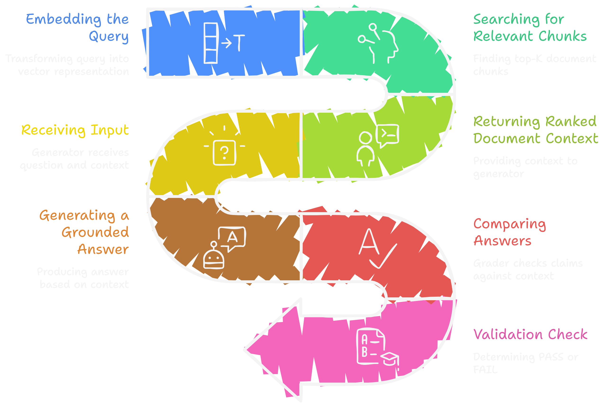

<h1 align="center">Self-Healing RAG — Blind Trust is Not Intelligence</h1>

<div align="center">


**This is not another RAG tutorial. This is what every modern RAG should be.**

*Retrieve → Generate → Grade → Rewrite → Retry → Or admit it doesn't know.*

</div>

<br/>
<br/>

## 🚨 The Problem Nobody Wants to Talk About

Every RAG demo you've seen on YouTube, Twitter, and GitHub looks great.<br/>
The demo retrieves a document. The LLM generates an answer. Everyone claps.

Then it goes to production.<br/>
And it starts hallucinating.

---

Here's what actually happens with a **basic RAG pipeline** in the real world:

- The retriever fetches the **wrong chunk** — slightly related, not actually relevant
- The LLM doesn't know the context is wrong, so it **fills the gaps with hallucinations**
- Nobody checks. The answer goes straight to the user
- The user trusts it. Because it sounds confident
- **The system never knew it was wrong. Not once.**

This is the dirty secret of every basic RAG system in production today.<br/>
**No validation. No self-check. No retry. Just blind generation and hope.**

That's not an AI assistant. That's a well-dressed random answer machine.

---

## ⚡ What This System Does Differently — And Why It Changes Everything

Most RAG systems are a **straight line**: retrieve → generate → done. <br/>
This system is a **loop with a brain**. <br/>
After generating an answer, it stops and asks itself:

> *"Is this answer actually supported by the documents I retrieved? Or did I just make this up?"*

If the answer is grounded — it returns it.<br/>
If the answer is hallucinated or unsupported — **it doesn't just give up or lie.** It rewrites the original query, tries a smarter retrieval, generates again, and grades again.

If it retries and still can't find a grounded answer — it says **"I don't have information on this"** with zero apology.<br/>
That is the entire philosophy in three lines. The rest of this README is engineering.

---

### The Three Ideas That Make This System Fundamentally Different

**1. Self-Evaluation** — The system judges its own output against source documents before returning anything to the user. Not with rules. With an LLM acting as a grader.

**2. Query Rewriting** — When retrieval fails, the system doesn't retry with the same broken query. It rewrites the query to be more specific, more semantic, more likely to retrieve the right chunk.

**3. Fail-Safe Fallback** — After N retries with no grounded answer, the system returns "I don't know." No hallucination. No false confidence. Just honesty.

This is not a feature list. This is a different way of thinking about what a RAG system is supposed to be.

---

## 🏗️ System Architecture

<p align="center">
  
</p>

This loop runs silently. The user never sees the retries. They either get a grounded answer or an honest admission. Nothing in between.

---

## 🔁 Step-by-Step Flow Explanation

### Step 1 — Retrieval

The user's question is embedded into a vector using a sentence transformer model. ChromaDB performs a cosine similarity search across all stored document embeddings and returns the top-K most semantically relevant chunks.

This is where most RAG systems place all their faith. If the retrieval is wrong, they don't find out until a user notices something is off — usually too late.

### Step 2 — Generation

The retrieved chunks and the original question are passed together to the LLM. The prompt explicitly instructs the model to answer **only from the provided context** — not from its training data, not from assumptions, not from general knowledge.

This constraint is critical. Without it, the LLM will blend retrieved content with hallucinated content and the output will look valid but won't be.

### Step 3 — Grading

This is the step that doesn't exist in 99% of RAG implementations.

A second LLM call is made — acting as a judge. It receives the original question, the retrieved documents, and the generated answer. It evaluates whether every factual claim in the answer can be traced back to the retrieved documents. This is not a keyword match. It's a semantic faithfulness check powered by the same LLM reasoning capability.

Output is binary: **PASS** or **FAIL**.

### Step 4 — Decision

**If PASS:** The answer is returned to the user immediately. It has been validated. It is grounded.<br/>
**If FAIL:** The answer is discarded. The user never sees it. The system moves to the rewriter.

### Step 5 — Query Rewriting

The rewriter receives the original query and a signal that retrieval + generation failed. It generates a semantically improved version of the query — different phrasing, broken into sub-questions, or stripped of ambiguous terms.

The rewritten query is not random. It is guided by the LLM's understanding of what might have caused the retrieval to miss. This is the intelligence that separates a retry loop from a smart retry loop.

### Step 6 — Retry Control

The system tracks how many times it has retried. Each loop increments a counter. If the counter is below the maximum (typically 2–3 retries), the rewritten query is sent back to the retriever and the entire cycle repeats.

### Step 7 — Final Fallback

If max retries are exhausted with no PASS, the system returns a clean, honest fallback message. No hallucination. No fabricated confidence. The system acknowledges the boundary of its knowledge.

This is not a failure state. This is the system working exactly as intended.

---

## ⚙️ Tech Stack

| Component | Technology | Why This Choice |
|---|---|---|
| **Vector Store** | ChromaDB | Lightweight, local-first, no infra overhead, perfect for document-grounded RAG |
| **LLM** | Google Gemini Flash 2.0 (Free Tier) | Fast inference, generous free quota, no cost for prototyping |
| **Orchestration** | LangGraph | Native support for stateful graphs, retry loops, and conditional branching |
| **Embeddings** | Sentence Transformers | High-quality semantic embeddings, runs locally, no API cost |
| **Backend** | Python 3.10+ | Clean, async-friendly, full ecosystem support |
| **Prompt Layer** | LangChain Core | Structured prompt templates with variable injection |

**Why Gemini Flash specifically?**

Because this system makes multiple LLM calls per query — generation + grading + optional rewriting. <br/>
Gemini Flash 2.0 offers a generous free tier with low latency, making the retry loop practically invisible to the user without any API cost during development and light production use.

**Why LangGraph over a simple Python loop?**

Because a Python loop doesn't give you state persistence, visual graph tracing, conditional edge routing, or easy extensibility to multi-agent flows. LangGraph treats each node (retriever, generator, grader, rewriter) as a first-class component with typed state. The graph is inspectable, debuggable, and extendable.

---

## 🧩 Key Components — Modular Breakdown

### Retriever
Responsible for converting the query to a vector and fetching semantically similar document chunks from ChromaDB. Completely decoupled — can be swapped to Pinecone, Weaviate, or pgvector without touching any other component.

### Generator
Takes (question + context) and produces a candidate answer. The prompt is strict: answer from context only. The model is not allowed to reason beyond what's in the retrieved chunks. This is enforced at the prompt level.

### Grader
The most important and most underrated component in this entire system. It's an LLM acting as a faithfulness evaluator. The grader prompt asks: *"Given the source documents and the answer, is the answer fully supported by the documents? Answer PASS or FAIL and explain why."*

The grader output drives the entire decision tree. Its reliability determines the system's reliability.

### Rewriter
When the grader returns FAIL, the rewriter analyzes the original question and generates a semantically better version. This isn't just synonym replacement. It's query decomposition, specificity adjustment, and intent clarification — all done by the LLM in a single structured prompt.

### Retry Controller
A simple but essential component. Tracks retry count in LangGraph state. Routes to retriever if retries remain. Routes to fallback if limit is reached. This is the nervous system of the loop.

---

## 🧠 Intelligent Features

**Self-Evaluation Loop**
The system evaluates itself on every single generation. Not with heuristics. Not with keyword matching. With an LLM that understands semantics and can reason about faithfulness. This is the core intelligence that makes the system self-healing rather than just self-aware.

**Hallucination Reduction**
By refusing to return any answer that fails the grading step, the system structurally prevents hallucinated responses from reaching the user. The grader acts as a semantic firewall between generation and output.

**Query Refinement**
Failed retrievals are not retried blindly. The query is actively improved before each retry. Over 2–3 attempts, the query converges toward the phrasing that will most likely retrieve the correct chunk from the vector store.

**Grounded Responses Only**
Every answer that exits this system has been verified against source documents by an LLM judge. Users can trace every claim back to a document. This is what "grounded" actually means — not just "retrieved from somewhere," but "every claim verified."

**Fail-Safe Fallback**
The system knows what it doesn't know. When no grounded answer can be found after all retries, it says so. This is not a bug. This is the highest form of reliability — a system that would rather admit ignorance than fabricate confidence.

---

## 💣 Basic RAG vs Self-Healing RAG

| Capability | Basic RAG | Self-Healing RAG |
|---|---|---|
| Retrieves relevant documents | ✅ | ✅ |
| Generates answer from context | ✅ | ✅ |
| Validates answer against source | ❌ | ✅ |
| Detects hallucinations before output | ❌ | ✅ |
| Rewrites failed queries | ❌ | ✅ |
| Retries with improved queries | ❌ | ✅ |
| Admits when it doesn't know | ❌ | ✅ |
| Grounded output guarantee | ❌ | ✅ |
| Safe for production use | ⚠️ Risky | ✅ Reliable |

Basic RAG is a pipeline. This is a system.

A pipeline runs once and returns whatever it produces. A system monitors its own output, evaluates quality, corrects course, and only returns what it can stand behind.

That is the entire difference. And in any domain where answers matter — legal, medical, financial, internal knowledge — that difference is the difference between trust and liability.

---

## ⚠️ Limitations — Because Honesty is Part of the Design

**Additional Latency**
Running 2–3 LLM calls per query instead of one adds latency. With Gemini this is minimized, but it's real. For latency-critical applications, the retry count should be kept at 1–2.

**Grader Reliability**
The grader is an LLM. LLMs are not perfect judges. It's possible (though rare) for the grader to mark a hallucinated answer as PASS, or a valid answer as FAIL. The system is more reliable than basic RAG, but it is not infallible.

**More API Calls = More Cost**
Each retry cycle adds one or two more LLM calls. At scale, this means 2–3x the token cost of a basic RAG system. For applications where answer quality justifies that cost, it's worth it.

**Retrieval is Still the Ceiling**
If the documents in the vector store don't contain the answer, no amount of query rewriting will find it. The system will exhaust retries and fall back. This is correct behavior, but it means the quality of the document corpus still matters enormously.

---

## 🌍 Real-World Use Cases

**Internal Company Knowledge Bots**
Employees ask questions about internal policies, processes, and documentation. A hallucinated answer from a basic RAG system isn't just annoying — it can cause real operational damage. Self-healing RAG returns only verified answers or admits uncertainty.

**Legal & Compliance Assistants**
Legal documents require exact, traceable answers. Hallucination is not a UX issue here — it's a legal liability. A graded, source-verified response pipeline is the only responsible architecture for legal Q&A.

**Medical Information Systems**
Clinical decision support, drug interaction lookups, patient record Q&A. In healthcare, a confidently wrong answer is dangerous. The fail-safe fallback alone makes self-healing RAG significantly safer than any basic alternative.

**HR & Policy Assistants**
Employee-facing HR bots handle sensitive questions about contracts, benefits, and procedures. Wrong answers erode trust fast. Grounded, validated answers — or honest "I don't know" responses — are the only acceptable standard.

**Documentation & Support Portals**
Technical support bots that answer questions from product documentation. Instead of hallucinating non-existent features or outdated procedures, the system verifies every claim before responding.

---

## 🔮 Future Improvements

- **Confidence Scoring** — Instead of binary PASS/FAIL, the grader assigns a confidence score (0.0 to 1.0). Answers below a threshold trigger rewrite. Borderline answers can be flagged for human review rather than discarded.

- **Multi-Agent Grading** — Run two independent grader LLMs and require consensus for PASS. Disagreement triggers a third tie-breaking call. Dramatically reduces grader false positives.

- **Retrieval Diversity on Retry** — On each retry, retrieve from a different semantic neighborhood of the query, not just a rewritten version of the same query. Increases coverage of the document space.

- **Fine-Tuned Grader Model** — Train a small, specialized model (3B–7B parameters) specifically for faithfulness evaluation. Faster, cheaper, and more accurate than using a general-purpose LLM as a judge.

- **Streaming Support** — Stream the final validated answer token-by-token to the frontend while keeping the grading loop fully synchronous in the background.

- **Explanation Layer** — Surface the grader's reasoning to the user optionally — showing which documents supported which claims. Full transparency mode.

- **Adaptive Retry Budget** — Dynamically adjust max retries based on query complexity. Simple factual queries get 1 retry. Multi-hop reasoning questions get 3–4.

---

## 🤝 Contributing

This system is open to the community. If you've thought about RAG reliability and have ideas, they're welcome here.

1. Fork the repository
2. Create a feature branch: `git checkout -b feature/your-idea`
3. Make your changes — keep components modular and focused
4. Test the full loop: retrieval → generation → grading → rewrite → retry → fallback
5. Commit: `git commit -m "feat: description of what you added"`
6. Push and open a Pull Request

Areas where contributions are especially valuable: grader prompt improvements, alternative rewriting strategies, evaluation benchmarks, and latency optimizations.

---

## 📄 License

MIT License — use it, fork it, build on it, ship it.

```
Permission is hereby granted, free of charge, to any person obtaining a copy
of this software to use, copy, modify, merge, publish, and distribute it,
subject to the condition that this copyright notice is included in all copies.

THE SOFTWARE IS PROVIDED "AS IS", WITHOUT WARRANTY OF ANY KIND.
```

See the [LICENSE](./LICENSE) file for full details.

---

## 💬 Support & Discussion

- **Issues** — Bug reports, grader misbehavior, retrieval failures
- **Discussions** — Architecture questions, use case ideas, performance tuning
- **PRs** — Always welcome. See contributing guide above.

---

## 🔥 Closing Statement

Every RAG system retrieves. Every RAG system generates.

This one **thinks about what it just said.**<br/>
That is not a small difference. That is the gap between a demo and a system you can actually deploy in production, stand behind, and trust with real users.

The self-healing loop, the query rewriter, the LLM grader, the fail-safe fallback — none of these are complicated ideas. They're just ideas that nobody bothered to wire together properly.<br/>
This repo does exactly that.

> *The goal was never to build a RAG that sounds smart. It was to build one that knows when it isn't.*

---

<div align="center">

Built with the conviction that **"I don't know"** is a better answer than a confident lie. 🧠

⭐ If this changes how you think about RAG reliability, leave a star. Help Others find this too.

</div>
